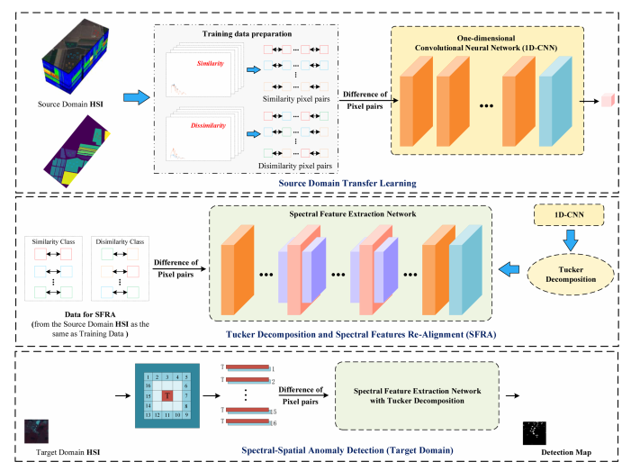

# TD-CNND

# This is the official implementation of the paper "Tucker Decomposition-Based Network Compression for Anomaly Detection With Large-Scale Hyperspectral Images" in  IEEE Journal of Selected Topics in Applied Earth Observations and Remote Sensing (JSTAR)

Paper link: https://ieeexplore.ieee.org/abstract/document/10537985



# Abstract:
<p style="text-align: justify;">
    Deep learning methodologies have demonstrated considerable effectiveness in hyperspectral anomaly detection (HAD).However, the practicality of deep learning-based HAD in real-world applications is impeded by challenges arising from limited labeled data, large-scale hyperspectral images (HSIs), and constrained computational resources. In light of these challenges, this article introduces a convolutional neural network (CNN)-based HAD model through the incorporation of Tucker decomposition, named TD-CNND. Drawing inspiration from transfer learning, the proposed model initially constructs pixel sample pairs from known labeled HSIs in the source domain, feeding them into the designed CNN to train the network learning spectral feature differences to obtain a CNN containing knowledge from the source domain. Subsequently, to prevent the need for network retraining caused by structural changes and to reduce model parameters for improving detecting timeliness, a general network compression scheme based on Tucker decomposition is applied to the CNN, where the convolutional layers of the above CNN undergo Tucker tensor decomposition to compress the network and alleviate parameter redundancy. Finally, spectral features realignment is used to recover the detection accuracy loss caused by Tucker tensor decomposition. In addition, a dual-windows structure is implemented during the detection phase, incorporating spatial information to the aforementioned spectral-level learning model, facilitating spectral-spatial collaborative HAD. Experimental evaluations using three real hyperspectral datasets and artificially expanded datasets demonstrate that, in comparison with state-of-the-art methods, the proposed TD-CNND method exhibits effectiveness and superiority in terms of both time cost and detection accuracy, where the notable advantages in terms of time cost become more pronounced with an increasing number of pixels.
</p>


# Citation：
Please cite us if our project is helpful to you!

```
@article{TD-CNND,
title={Tucker Decomposition-Based Network Compression for Anomaly Detection With Large-Scale Hyperspectral Images},
author={Yulei Wang andHongzhou Wang and Enyu Zhao and Meiping Song andChunhui Zhao },
journal={ IEEE Journal of Selected Topics in Applied Earth Observations and Remote Sensing},
year={2024},
publisher={IEEE}
}
```

# Workflow：

#### 1. Train:

<p style="text-align: justify;">
Transfer learning is achieved through the labeled hyperspectral classification dataset in the source domain to obtain a deep model for implementing the detection task in the target domain.
</p>

#### 2. Tucker_adjust:

<p style="text-align: justify;">
    The deep model obtained by <b>1.train </b>is subject to Tucker decomposition and spectral features realignment to obtain the final deep model for target domain detection.
</p>

#### 3. Eval&dec

<p style="text-align: justify;">
Achieve the anomaly detection task of the target domain.
</p>
